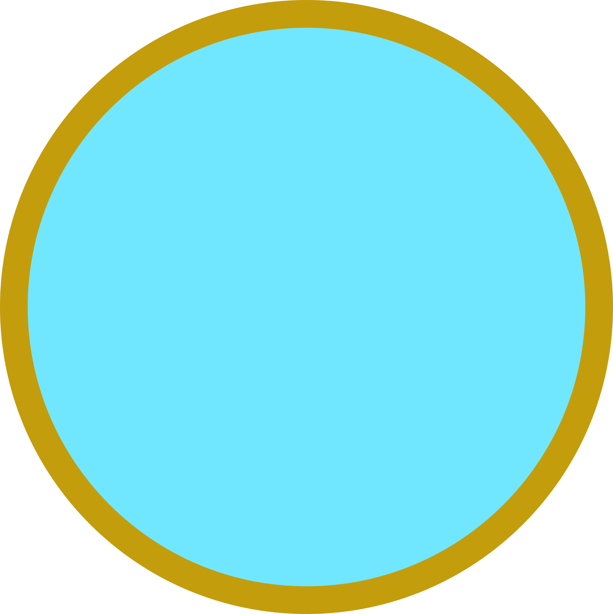
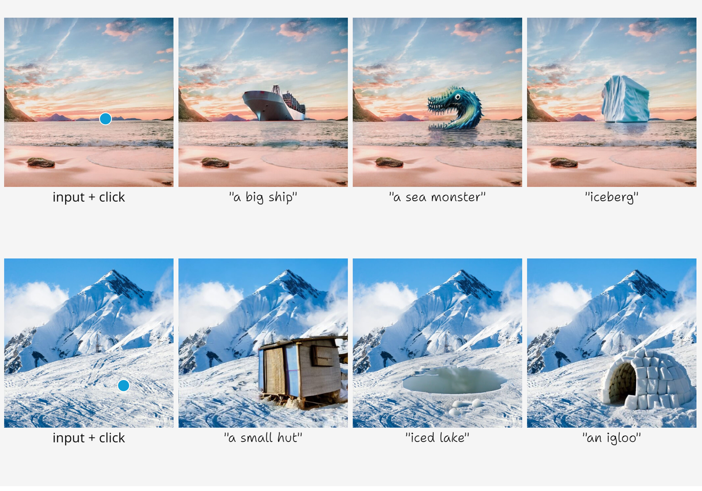
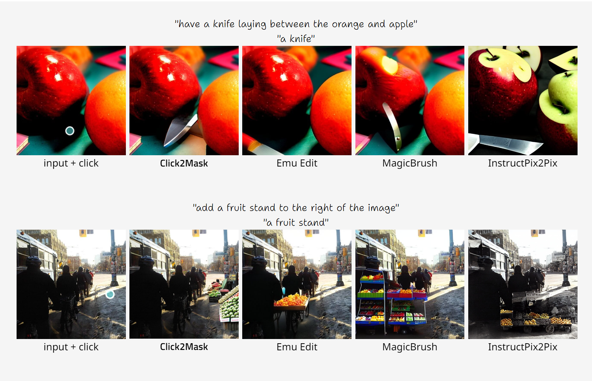

# Click2Mask: Local Editing with Dynamic Mask Generation

Official PyTorch Implementation for 
["Click2Mask: Local Editing with Dynamic Mask Generation"](https://omeregev.github.io/click2mask/).

<a href="https://omeregev.github.io/click2mask/"></a>
<a href="https://omeregev.github.io/click2mask/">Project</a>
<a href="https://arxiv.org/abs/2409.08272" style="margin-left: 15px;">
  
</a>
<a href="https://arxiv.org/abs/2409.08272">arXiv</a>
<a href="https://omeregev.github.io/click2mask/static/paper/Click2Mask.pdf" style="margin-left: 15px;">
  
</a>
<a href="https://omeregev.github.io/click2mask/static/paper/Click2Mask.pdf">Paper</a>
<br><br>


<a href="https://omeregev.github.io/click2mask/">**Click2Mask: Local Editing with Dynamic Mask Generation**</a>
<br>
<a href="https://www.linkedin.com/in/omeregev/">Omer Regev</a>,
<a href="https://omriavrahami.com/">Omri Avrahami</a>,
<a href="https://www.cs.huji.ac.il/~danix/">Dani Lischinski</a>

Given an image, a <span style="white-space: nowrap;">
    <b>Click</b> 
</span>, and a prompt for an added object, a **Mask** is generated dynamically, 
simultaneously with the object generation throughout the diffusion process.

Current methods rely on existing objects/segments, or user effort (masks/detailed text), 
to localize object additions. Our approach enables free-form editing, 
where the manipulated area is not well-defined, using just a  <span style="white-space: nowrap;">
    <b>Click</b> 
</span> for localization.


## Results

### Output Examples
Each example includes an input image with a <span style="white-space: nowrap;">
    <b>Click</b> 
</span>, 
followed by outputs corresponding to the prompts below.


### Qualitative Comparisons with SoTA Methods
A brief glimpse into the qualitative comparison between the SoTA methods — 
[Emu Edit](https://emu-edit.metademolab.com),
[MagicBrush](https://osu-nlp-group.github.io/MagicBrush/)
and [InstructPix2Pix](https://timothybrooks.com/instruct-pix2pix)
— against our model, [**Click2Mask**](https://omeregev.github.io/click2mask/). 
<br>
Upper prompts were given to baselines, and lower (shorter) ones to **Click2Mask**.
Inputs contain the <span style="white-space: nowrap;">
    <b>Click</b> 
</span> given to **Click2Mask**.



## Installation
Go to project directory:
```bash
cd /path/to/project/click2mask
```

Install and activate the conda virtual environment:
```bash
conda env create -f environment.yml
conda activate c2m
```

Download from [Alpha-CLIP Model Zoo](https://github.com/SunzeY/AlphaCLIP/blob/main/model-zoo.md) 
the following checkpoint (1.2GB):
```bash
mkdir checkpoints
wget -P checkpoints https://download.openxlab.org.cn/models/SunzeY/AlphaCLIP/weight/clip_l14_336_grit1m_fultune_8xe.pth
```

If the above link is broken, you can use this 
[Google Drive mirror](https://drive.google.com/file/d/1DeNbUv0lraDxJZItb7shTlvGW6z_Z9Si/view?usp=drive_link).


## Usage
1) Run:
```bash
python scripts/text_editing_click2mask.py --image_path "<path/to/input/image>" --prompt "<the prompt>" --output_dir "<path/to/output/directory>" 
```
For example:
```bash
python scripts/text_editing_click2mask.py --image_path "examples/example1/img1.jpg" --prompt "a sea monster" --output_dir "outputs" 
```
2) A window will pop to enable a _clicked point_ over the input image. Once you have clicked with the mouse, press "Enter".


3) The clicked point will be saved in the input directory as
<span style="white-space: nowrap;">"path/to/input/image_click.jpg"</span> for future use.
For example:
```bash
python scripts/text_editing_click2mask.py --image_path "examples/example2_existing_click/img2.jpg" --prompt "a sea monster" --output_dir "outputs" 
```

4) If you wish to change the clicked point in future use, delete it or add the argument <code>"--refresh_click"</code>:
```bash
python scripts/text_editing_click2mask.py --image_path "examples/example1/img1.jpg" --refresh_click --prompt "a sea monster" --output_dir "outputs" 
```

## Evaluating Edited Regions in Maskless Methods
We introduce **Edited Alpha-CLIP** to evaluate mask-free methods by extracting a mask of the edited region 
and using [Alpha-CLIP](https://aleafy.github.io/alpha-clip/) to assess its alignment with the prompt.
<br>
Examples of mask extractions: outputs are on the left, extracted masks (green overlay) on the right.


To run **Edited Alpha-CLIP** similarity tests for methods comparison, 
here is a usage example (see documentation in script):
```bash
from scripts.similarity_tests.edited_alpha_clip import EditedAlphaCLip
edited_ac = EditedAlphaCLip()
image_in_p = "examples/edited_alpha_clip/input.png"
image_out_p = "examples/edited_alpha_clip/magic_brush.jpg"
prompt = "A bench"
save_outs = "outputs/edited_alpha_clip/bench_mb"
similarity = edited_ac.edited_alpha_clip_sim(image_in_p, image_out_p, prompt, save_outs)
```
A higher result is better.


## Citation
If you find this helpful for your research, please reference the following:
```bibtex
@misc{regev2024click2masklocaleditingdynamic,
      title={Click2Mask: Local Editing with Dynamic Mask Generation}, 
      author={Omer Regev and Omri Avrahami and Dani Lischinski},
      year={2024},
      eprint={2409.08272},
      archivePrefix={arXiv},
      primaryClass={cs.CV},
      url={https://arxiv.org/abs/2409.08272}, 
}
```

## Acknowledgements
This code is based on 
[Blended Latent Diffusion](https://github.com/omriav/blended-latent-diffusion/tree/master) 
and on [Latent Diffusion Models](https://github.com/CompVis/latent-diffusion).
We thank also [Image Prompter for Gradio](https://github.com/PhyscalX/gradio-image-prompter).
